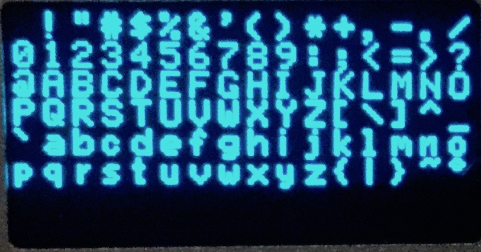
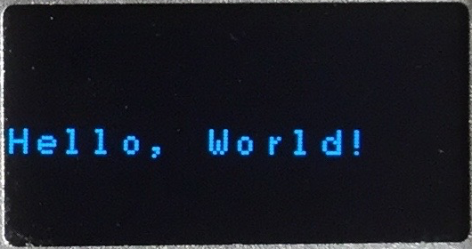

# NanoHat OLED - Swift4 Version

This is a swift library written for using the NanoHat OLED: http://wiki.friendlyarm.com/wiki/index.php/NanoHat_OLED

supported boards:

- NanoPi NEO
- NanoPi NEO Air
- NanoPi NEO2
- NanoPi NEO Plus2

## Basic Font



## Installation

Install it with the Swift Package Manager.

``` swift
// swift-tools-version:4.0

import PackageDescription

let package = Package(
    name: "YourApp",
    products: [
        .executable(name: "YourApp", targets: ["YourApp"]),
    ],
    dependencies: [
        .Package(url: "https://github.com/creekpld/nanohat-oled.git", from: "1.0.0")
    ],
    targets: [
        .target(
            name: "YourApp",
            dependencies: ["NanoHatOLED"],
            path: "Sources"),
    ]
)
```

## Usage


``` swift
import NanoHatOLED

let oled = OLED() // default bus = 0, address = 0x3c

// initialize display
oled.setup()

// clear display
let arr = [UInt8](repeating: 0x00, count: 1024)
oled.sendArrayData(arr)

// set Cursor/Text Position
oled.setTextXY(0,4)

// print Hello, World!
let word = "Hello, World!"
for char in word {
    print("putChar=\(char)")
    oled.putChar(char.description)
}
```
Result:


## Other Implementations

- [NanoHatOLED](https://github.com/friendlyarm/NanoHatOLED)

## License

NanoHatOLED is available as open source under the terms of the [MIT License](http://opensource.org/licenses/MIT).
